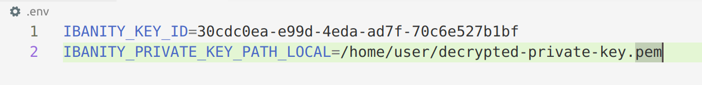
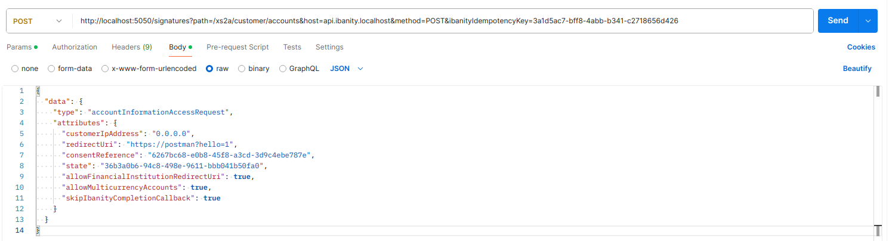
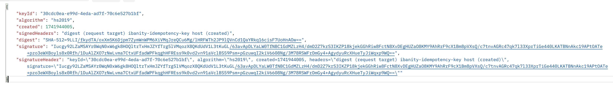
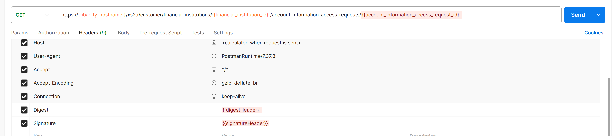

# Ibanity signature service

This service can be ran locally, in a Kubernetes cluster, ... to easily create your signatures to call the different APIs offered by Ibanity. See https://documentation.ibanity.com/security#http-signature for more info on the signature format.

## Setting up the service

Enclosed in this project is a .env.template. Copy this file and name it .env, then fill in the variables with your correct values (not the ones in attached screenshot).

### Private key format

If you've set a passphrase on your private key, make sure to decrypt your key before passing it to the service:
`openssl rsa -in <encrypted_private.key>  -out <decrypted_private.key>`

## Running the service

The project contains a `docker-compose.yaml` file which reads in the correct variables from the `.env` file. Just run `docker-compose up` and the service will start on port `8080`.

## Calling the service

The signature is made up of several signature parts, for which the service needs following data:
- host **(query parameter)**
- path **(query parameter)**
- method **(query parameter)**
- payload **(not for GET and DELETE requests, passed via request body)**
- ibanityIdempotencyKey **(optional)**
- authorization **(optional)**

## Using the response

As noted on https://documentation.ibanity.com/security#http-signature, you'll need the digest of the payload and the signature to sucessfully call the Ibanity API. To this end, the signature service returns a response in the following format:

You can then directly use the digest and the signatureHeader values for your requests to the Ibanity API:

**Make sure to remove the backslashes from the signatureHeader before using it as a header value for your request!**

## TLS

TLS will be supported out of the box in the future. For now, you should run the service behind your own TLS proxy if needed. Be aware that the authorization query parameter and the payload will be passed over HTTP unencrypted if the service is used without TLS enabled.